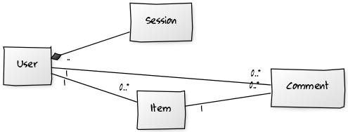

# Kirpputori

### Ruby on Rails -harkkatyö

Kirpputori on alkeellinen ja puutteellinen versio tori.fi:stä, jossa kirjautuneet käyttäjät voivat lisätä myytäviä esineitä kaikkien sivustolla käyvien nähtäväksi. Lisäksi kirjautuneet käyttäjät pystyvät kommentoimaan sekä omia että muiden käyttäjien lisäämiä esineitä. Kirjautuminen edellyttää rekisteröitymistä. Kirjautumattomat voivat ainoastaan selata esineitä sekä niihin liittyviä kommentteja.

##### Käyttöohje

Aluksi kannattaa siirtyä rekisteröitymiseen (navigointipalkissa "Register"), luoda tili ja sitten kirjautua (navigointipalkissa "Log in") kyseisellä tilillä. Uuden esineen lisääminen onnistuu klikkaamalla navigointipalkista kohtaa "New Item". Kaikkien esineiden näkymään siirrytään kohdasta "All Items". Omien esineiden kohdalla on linkki "Destroy", joista poisto onnistuu. Kaikki käyttäjät pääsevät näkemään minkä tahansa esineen kommentit klikkaamalla esineen nimeä. Sivulla on taulukko, johon kirjautunut käyttäjä voi lisätä oman kommenttinsa klikkaamalla "New comment". Taulukossa on omien kommenttien kohdalla linkki sekä kommentin muokkaukseen että poistamiseen.

##### Testaus

Kaikkia kolmea luokkaa on testattu rspecillä sen verran, että konstruktori asettaa arvoja oikein ja että olio tallettuu tietokantaan vain, jos se läpäisee validoinnit. Lisäksi capybaralla on testattu tilin luominen sekä sisäänkirjautuminen. Näissä testeissä ei kaikkia alkeistapauksia ole, vaan lähinnä yksi (jollain tavalla) virheellinen syöte ja sitten oikea. Loput, kuten esineen luonti ja poisto sekä kommentin luonti, muokkaus sekä poisto, on testattu manuaalisesti.

##### Huomioitavaa!

Herokun kanssa tuli pari tuntia ennen deadlineä ongelma, eikä käyttäjän luominen ensin onnistunut. Tämä tarkoittaa, ettei juuri minkään muunkaan toiminnallisuuden näkeminen ollut mahdollista. Suoritin kaikki migraatiot, myös Herokuun, ja pushasin uusimman version. Lopulta sovellus toimi myös Herokussa. Mikäli Heroku ei toimisi eikä sovellusta siksi pystyttäisi arvioimaan, pyydän ottamaan yhteyttä sähköpostitse timo.hautamaki@hotmail.com, niin tulen näyttämään sovelluksen omalla koneellani sovittuun aikaan ja paikkaan. Localhostilla kaikki on kuitenkin pelannut hienosti koko ajan.

##### Tuntikirjanpito

 * su 6.3. klo 8-12

   - Aiheen mietintää 
   - Sovelluksen luontia 
   - Rakenteen suunnittelua

 * to 12.5. klo 10-15, klo 18-22

   - Errorien metsästystä
   - MVC-mallin toteutus (reititykset kuntoon, controllereihin tarvittavia instanssimuuttujia, vieweihin sisältö karkeassa muodossa)
   - Rakenne ideana valmis
   - Sovellus Herokuun
    
 * pe 13.5. klo 14-17, klo 18-22
   
   - Tiedonhakua
   - Errorien metsästystä
   - Bootstrap käyttöön
   - Navigointipalkki simppeliksi
   - Viewit uusiksi rakennetta myöden (vähemmän näytettäviä sivuja, kaikkialta ei pääse kaikkialle, Itemin ja Commentin indexeihin taulukko)
   - rajoituksia kirjautumattomille/oikeuksia kirjautuneille

 * la 14.5. klo 16-24

   - Tiedonhakua
   - Errorien metsästystä
   - Manuaalista testausta
   - Dokumentaatiota (Datamalli, Käyttötarkoitus, Käyttöohje)
   - Migraatioilla lisäkentät Item:iin ja Comment:iin
   - Itemin ja Commentin indexien taulukoihin rajoituksia

 * su 15.5. klo 8-17, klo 19-23

   - Tiedonhakua
   - Errorien metsästystä
   - Testien luontia
   - Manuaalista testausta
   - Turhien linkkien poistelua vieweistä, tarpeellisten fiksaamista
   - Validoinnit
   - Taulukoiden sarakkeiden leveyksien kontrollointia, joissain kentissä homma hoidettu automaattisella rivinvaihdolla ja joissain validoinneilla.

[Linkki herokuun](https://fast-shelf-18517.herokuapp.com/)
